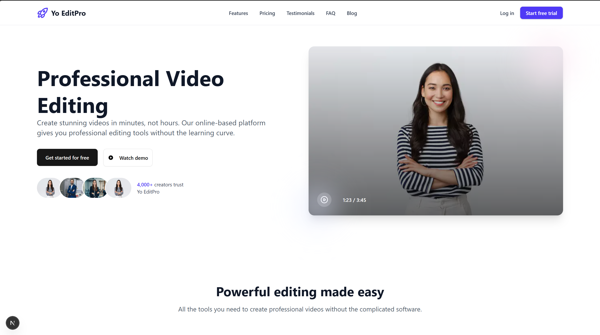

# Video Editing Platform - Frontend



## Overview
A responsive web-based video editing interface built with Next.js and React that allows users to upload, edit, and preview videos directly in their browser. This frontend implementation focuses on creating a realistic editing experience with mock APIs.

## Features

### Core Functionality
- 🎬 Drag-and-drop video upload with preview
- ✂️ Interactive timeline for scene rearrangement
- 🔊 Audio waveform visualization and controls
- 📝 Subtitle and text overlay management
- 🖼️ Image overlay positioning and styling
- 👁️ Real-time editing preview
- ⚡ Mock export functionality

### Technical Highlights
- Built with Next.js App Router
- State management with Redux Toolkit
- Responsive design with Tailwind CSS
- ShadCN UI components for consistent styling
- Drag-and-drop interfaces with React DnD

## Live Demo
[View Demo](https://yo-edit-pro.vercel.app/)

## Installation

1. **Clone the repository**
   ```bash
   git clone https://github.com/Yogesh0arya/Yo-EditPro
   cd Yo-EditPro
   npm install

2. **Development**
   ```bash
   npm run dev
